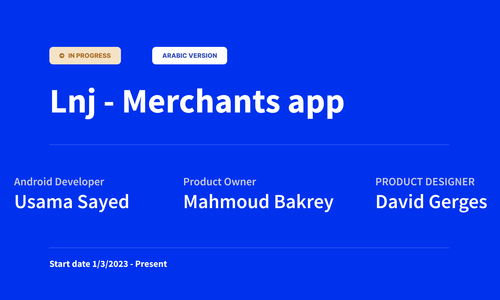
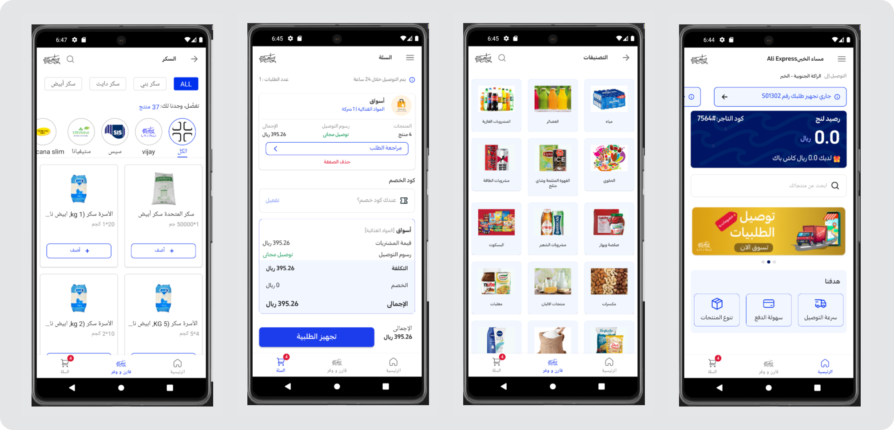
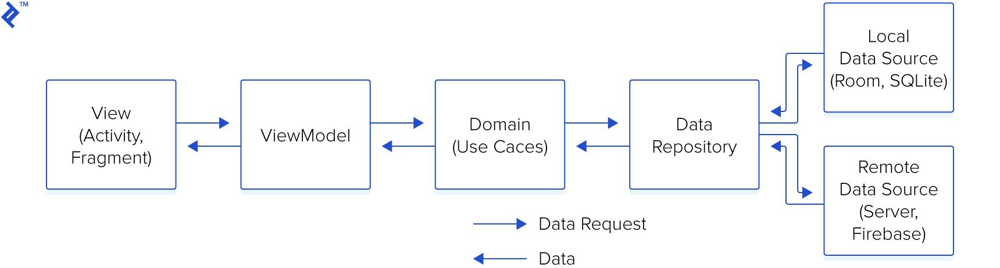

Lnj Merchants App
==================

**Lnj Merchants App Repository is an ongoing project,🚧 Look how this app was designed and built in the [design case study](https://goo.gle/nia-figma](https://www.figma.com/file/IN2kItj0Uecjwguriit22U/LNJ---Merchant-App?type=design&mode=design&t=5RMadKxPufCaTTfp-1)), and [architecture learning journey](docs/ArchitectureLearningJourney.md).**

# Features

**Lnj Merchants App** revolutionizes B2B e-commerce, connecting wholesalers and distributors with retailers. Enjoy an enhanced buying and selling journey, effortless, efficient, and cost-effective. Select all your facility's needs, compare prices, and secure the best deals from Ling. Your one-stop solution for streamlined procurement!
## Screenshots

## Built With 🛠

- [Kotlin](https://kotlinlang.org/) - First class and official programming language for Android
  development.
- [Coroutines](https://kotlinlang.org/docs/reference/coroutines-overview.html) - For asynchronous
  and more..
- [Android Architecture Components](https://developer.android.com/topic/libraries/architecture) -
  Collection of libraries that help you design robust, testable, and maintainable apps.
    - [Flows](https://developer.android.com/kotlin/flow) - A flow is a type that can emit multiple
      values sequentially, as opposed to suspending functions that return only a single value.
    - [ViewModel](https://developer.android.com/topic/libraries/architecture/viewmodel) - Stores
      UI-related data that isn't destroyed on UI changes.
    - [Jetpack Navigation](https://developer.android.com/guide/navigation) - Navigation refers to
      the interactions that allow users to navigate across, into, and back out from the different
      pieces of content within your app
    - [Hilt](https://developer.android.com/training/dependency-injection/hilt-android) - Hilt is a
      dependency injection library for Android that reduces the boilerplate of doing manual
      dependency injection in your project.
        - [Retrofit](https://square.github.io/retrofit/) - Is a type-safe REST client for Android
          which
          aims to make it easier to consume RESTFul web services.
    - [Glide](https://bumptech.github.io/glide/) - An image loading and caching library for Android.
       

## Architecture 🗼

This app uses [***Clean Architecture***](https://developer.android.com/topic/architecture) With [
***MVVM (Model View
View-Model)***](https://developer.android.com/jetpack/docs/guide#recommended-app-arch) architecture.

## Tasks are ready for testing (Done)

- 21/8/2023
- home screen finished, still waiting APIs

## current task

- work on driver app 2
- work on b2b app (Alaa's issues) 3
- meeting with Zaynab (product screen) 30m
- remaining 2,5 h

## I have to-do

- Gradle version catalog
- Design the Login screen

## needs from Zaynab (backend)

## needs from David (designer)

- check on status of user when make an order in the mainBasket (David)

