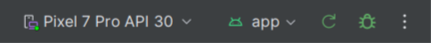

Lnj Merchants App
==================

**Lnj Merchants App Repository is an ongoing project,🚧 Look how this app was designed and built in the [design case study](https://goo.gle/nia-figma](https://www.figma.com/file/IN2kItj0Uecjwguriit22U/LNJ---Merchant-App?type=design&mode=design&t=5RMadKxPufCaTTfp-1)), and [architecture learning journey](docs/ArchitectureLearningJourney.md).**

# Features

**Lnj Merchants App** revolutionizes B2B e-commerce, connecting wholesalers and distributors with retailers. Enjoy an enhanced buying and selling journey, effortless, efficient, and cost-effective. Select all your facility's needs, compare prices, and secure the best deals from Ling. Your one-stop solution for streamlined procurement!
## Screenshots

# Development Environment

**Lnj Merchants App** uses the Gradle build system and can be imported directly into Android Studio, ensure you are using 
- Android Studio Hedgehog | 2023.1.1 Patch 1 [here](https://developer.android.com/studio/archive) 
- Kotlin Version: 1.9.22
- Android Gradle Plugin Version: 8.2

Change the run configuration to `app`.

Once you're up and running, you can refer to the learning journeys below to get a better
understanding of which libraries and tools are being used, the reasoning behind the approaches to
UI, architecture, and more, and how all of these different pieces of the project fit
together to create a complete app.

# Architecture

The **Lnj Merchants** app follows the
[official architecture guidance](https://developer.android.com/topic/architecture) 
and is described in detail in the
[architecture learning journey](docs/ArchitectureLearningJourney.md).

# UI
The app was designed using [Material 2 guidelines](https://m2.material.io/). Learn more about the design process and 
obtain the design files in the [Lnj Merchants App Material 2 Case Study](https://www.figma.com/file/IN2kItj0Uecjwguriit22U/LNJ---Merchant-App?type=design&mode=design&t=5RMadKxPufCaTTfp-1)).
The Screens and UI elements are built entirely using [Layouts in Views](https://developer.android.com/develop/ui/views/layout/declaring-layout). 

The app has two themes: 

- Dynamic color - uses colors based on the [user's current color theme](https://material.io/blog/announcing-material-you) (if supported)
- Default theme - uses predefined colors when dynamic color is not supported

Each theme also supports dark mode. 

The app uses adaptive layouts to
[support different screen sizes](https://developer.android.com/guide/topics/large-screens/support-different-screen-sizes).

Find out more about the [UI architecture here](docs/ArchitectureLearningJourney.md#ui-layer).

## Built With 🛠

- [Kotlin](https://kotlinlang.org/) - First class and official programming language for Android
  development.
- [Coroutines](https://kotlinlang.org/docs/reference/coroutines-overview.html) - For asynchronous
  and more..
- [Android Architecture Components](https://developer.android.com/topic/libraries/architecture) -
  Collection of libraries that help you design robust, testable, and maintainable apps.
    - [Flows](https://developer.android.com/kotlin/flow) - A flow is a type that can emit multiple
      values sequentially, as opposed to suspending functions that return only a single value.
    - [ViewModel](https://developer.android.com/topic/libraries/architecture/viewmodel) - Stores
      UI-related data that isn't destroyed on UI changes.
    - [Jetpack Navigation](https://developer.android.com/guide/navigation) - Navigation refers to
      the interactions that allow users to navigate across, into, and back out from the different
      pieces of content within your app
    - [Hilt](https://developer.android.com/training/dependency-injection/hilt-android) - Hilt is a
      dependency injection library for Android that reduces the boilerplate of doing manual
      dependency injection in your project.
        - [Retrofit](https://square.github.io/retrofit/) - Is a type-safe REST client for Android
          which
          aims to make it easier to consume RESTFUL web services.
    - [Glide](https://bumptech.github.io/glide/) - An image loading and caching library for Android.
       

## Architecture 🗼

This app uses [***Clean Architecture***](https://developer.android.com/topic/architecture) With [
***MVVM (Model View
View-Model)***](https://developer.android.com/jetpack/docs/guide#recommended-app-arch) architecture.

## Tasks are ready for testing (Done)

- 21/8/2023
- home screen finished, still waiting APIs

## current task

- work on driver app 2
- work on b2b app (Alaa's issues) 3
- meeting with Zaynab (product screen) 30m
- remaining 2,5 h

## I have to-do

- Gradle version catalog
- Design the Login screen

## needs from Zaynab (backend)

## needs from David (designer)

- check on status of user when make an order in the mainBasket (David)

